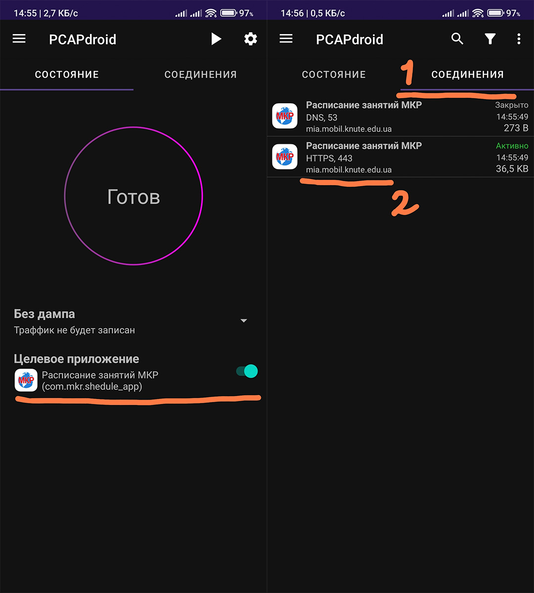

# How to get the API link of your university

## 1. Using mkr.org.ua api

This is the easiest way.

Just go to https://mkr.org.ua/api/v2/university/list and look for your university in the list. You need the "api.url" field, not just "url" (!)

## 2. Alternate way (deprecated)

Using the MKR schedule mobile app and packet capture app.

To do this, you will need the following apps:
* MKR schedule - https://play.google.com/store/apps/details?id=com.mkr.shedule_app
* Any packet capture app, I use PCAPdroid - https://play.google.com/store/apps/details?id=com.emanuelef.remote_capture

To get started, make sure you have selected the timetable for your university in the MKR app. 
It will also be useful to add MKR to the filter in the packet capture app as in screenshot 1, to avoid confusion. 
We don't need SSL decryption.

### Getting started
1. Run a packet capture
2. Go to the MKR App
3. Return to the packet capture application and stop it

After we exited the MKR application and stopped capturing, we received the required data, as in screenshot 2.
### This is our URL.

 

